# SystemeFeerie-FoundryVTT

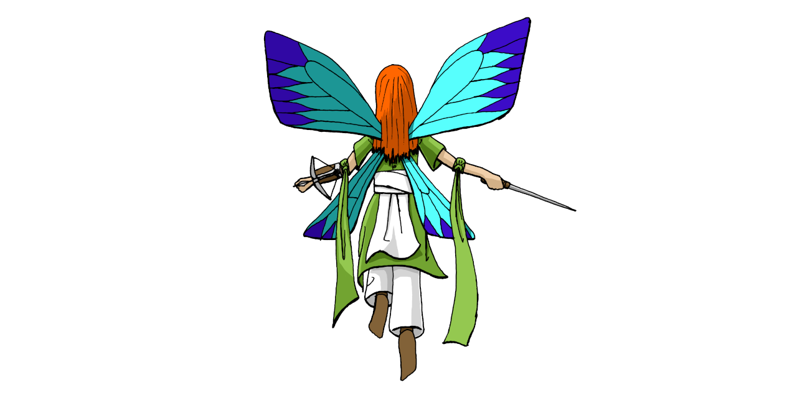

Ce système est conçu pour jour aux jeux utilisant le [*Système Féerie*](https://systeme.feerie.net) avec [*Foundry Virtual Tabletop*](https://foundryvtt.com/).

Le *Système Féerie* est un système de simulation générique descriptif qui favorise la description aux mécaniques habituelles de la plupart des jeux de rôle, que ce soit au niveau de la création des personnages que du système de résolution des actions.

## Informations techniques

Lien vers le manifeste du système :
* https://github.com/Greewi/SystemeFeerie-FoundryVTT/releases/latest/download/system.json

Prérequis :
* [*FoundryVTT*](https://foundryvtt.com/) : le logiciel de table virtuelle pour lequel ce système a été conçu.

Modules conseillés :
* [Dice so Nice](https://foundryvtt.com/packages/dice-so-nice/) : des dés en 3D, ou comment retrouver la joie de voir les dés rouler en temps réel.

## Screenshots

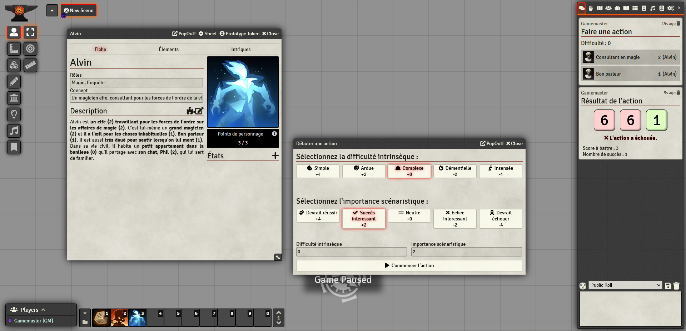

## Installation

Via l’installateur de *Foundry* :
1. Dans le menu `Game Systems` de *Foundry*, cliquez sur `Install System`
2. Entrez `https://github.com/Greewi/SystemeFeerie-FoundryVTT/releases/latest/download/system.json` dans Manifest URL
3. Cliquez sur `Install`

Créer et initialiser un monde :
1. Dans le menu `Game Worlds` de *Foundry*, cliquez sur `Create World` ;
2. Dans `Game System` sélectionnez `Système Féerie` ;
3. Remplissez les autres informations à votre convenance et cliquez sur `Create World` ;
4. Connectez-vous en gamemaster et allez dans l’onglet `Game settings` ;
5. Allez dans `Manage Modules` ;
6. Activez les modules que vous souhaitez utiliser

Installer les compendiums :
1. Allez dans l’onglet `Compendium Packs` ;
2. Pour chaque compendium que vous voulez utiliser : cliquez droit sur le compendium puis cliquez `Importer tout le contenu` (Attendez que l’opération soit finie avant de traiter le compendium suivant) ;
3. Donnez les droits d’observateur aux joueurs des éléments qui vous intéressent (attention, donner les droits sur un dossier, ne donne pas les droits sur les éléments des sous-dossiers !) ;
4. Pour le compendium `__Macros`, nous vous conseillons de glisser les macros dans votre barre de raccourcis. Si vous utilisez la règle des jets de chance, vous voudrez aussi que vos joueurs aient accès à la macro correspondante.

## Configurer le module

Pour utiliser ce module nous vous recommandons de vous familiariser avec les règles du Système Féerie, version 5 ou 6 que vous trouverez sur le [site du Système Féerie](https://systeme.feerie.net) (à l'heure actuelle la version 6 est encore en tests, mais vous pouvez nous contacter si vous souhaitez l'essayer).

Notez que le Système Féerie est un système très malléable et l'implémentation de ce Module vous demandera un peu de configuration bien que vous trouverez des adaptations prête à être utilisées dans les compendiums.

Dans tous les cas, vous devrez récupérer ou configurer les pièces du système suivantes :
* les **catégories d'éléments**, et notamment les **états** ;
* les **informations descriptives** ;
* les **ressources** ;
* les **actions**.

Vous voudrez probablement aussi créer un template de personnage pour pas avoir à refaire les listes des **informations descriptives**.

## Liste des compendiums

Général :
* *__Macros* (**Nécessaire**) : contient les macros nécessaires pour démarrer une action et effectuer un jet de chance.

Système Féerie V5 :
* *V5 Règles* : les règles du Système Féerie V5.
* *V5 Config* : une configuration "neutre" pour utiliser le Système Féerie V5.
* *V5 Template* : un template de personnage "neutre" pour utiliser le Système Féerie V5.

Système Féerie V6 :
* *V6 Règles* : les règles du Système Féerie V6.
* *V6 Config* : une configuration "neutre" pour utiliser le Système Féerie V6.
* *V6 Template* : un template de personnage "neutre" pour utiliser le Système Féerie V6.

Solaires (TODO : pas encore inclus) :
* *V5 Solaires - Règles* : les règles du jeu Solaires en Système Féerie V5.
* *V5 Solaires - Config* : la configuration pour jouer à Solaires en Système Féerie V5.
* *V5 Solaires - Template* : un template de personnage pour Solaires, ainsi que deux équipes de pré-tirés.

### Créer une catégorie d'éléments

Les **catégories d'éléments** servent à classifier les éléments et à définir leur échelle de niveau.

Vous pouvez créer une **catégorie d'éléments** en créant un nouvel Item de type *category*.

Dans la fenêtre d'édition d'une catégorie, vous pourrez définir :
* le **nom** de la catégorie (par exemple Carrière) ;
* l'**abréviation** de la catégorie (par exemple C) ;
* la **description** de la catégorie ;
* les **niveaux** et leur correspondance dans l'univers du jeu.

Notez que l'icône que vous choisirez pour une catégorie sera appliquée à tous les éléments de cette catégorie.

Vous pouvez marquer une catégorie comme étant un **état** : le module traitera alors les **éléments** de cette **catégorie** comme des **états** et les rangera dans la zone appropriée de la fiche.

Par la suite, vous pourrez sélectionner cette **catégorie** lorsque vous créerez ou éditerez un **élément**.

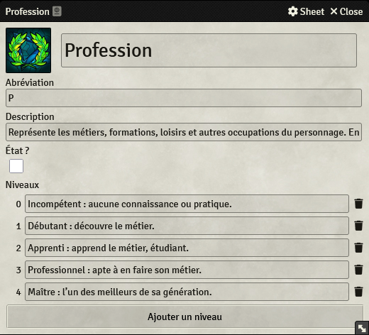

### Informations descriptives

Les **informations descriptives** servent à décrire des points du personnage qui ne font pas partie de ses éléments. Par exemple avec le Système Féerie V5, vous aurez généralement au moins le **Concept** et les **Rôles** du personnage. On y retrouve aussi les informations propres à l'identité du personnage. 

Vous pouvez directement créer une **information descriptive** sur la fiche d'un personnage en cliquant sur le symbole **+** de la section, ou vous pouvez la créer sous la forme d'un Item de type *information* que vous pourrez ensuite glisser-déposer sur les fiches des personnages.

Dans la fenêtre d'édition, vous pourrez définir :
* le **nom** de l'information descriptive (par exemple Nationalité) ;
* la **valeur** de l'information descriptive (par exemple Française), vous pouvez la laisser vide si vous ne la créez pas directement sur la fiche d'un personnage.

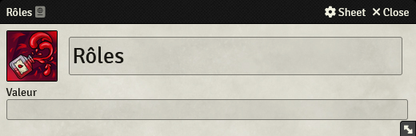

### Ressources

Les **ressources** servent à comptabiliser certaines réserves, par exemple les points de personnage avec le Système Féerie V5, mais vous pourrez aussi avoir des points de chance, d'expérience ou toute autre ressource nécessaire pour le jeu.

Vous pouvez directement créer une **ressource** sur la fiche d'un personnage en cliquant sur le symbole **+** de la section, ou vous pouvez la créer sous la forme d'un Item de type *ressource* que vous pourrez ensuite glisser-déposer sur les fiches des personnages.

Dans la fenêtre d'édition, vous pourrez définir :
* leur **nom** (par exemple, Points de chance) ;
* leur **maximum** (par exemple, 3), s'il est fixé à 0, il n'y a pas de maximum ;
* leur **valeur actuelle** que vous pouvez initialiser à une valeur par défaut.

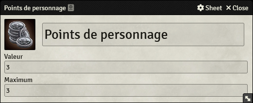

### Actions

Les **actions** servent à déterminer les règles de résolution des actions. Si le processus de résolution était fixe pour le Système Féerie V5, il est très personnalisable en Système Féerie V6. Il est même possible de définir plusieurs actions, notamment pour les jeux qui proposent des échelles de difficultés alternatives, par exemple pour gérer la magie. Pour en créer une, créez un nouvel Item de type *action*.

Dans la fenêtre d'édition, vous pourrez définir :
* la **version du Système Féerie** à utiliser (version 5 ou 6) ;
* le **nombre maximum d'éléments** que les joueurs peuvent utiliser (mettez *2* en V5) ;
* la **méthode de calcul du niveau des personnages** (mettez *Somme des éléments* en V5) ;
* la **méthode utilisée pour déterminer la qualité des réussites et échecs** (non pertinent en V5) ;
* l'**échelle de difficulté intrinsèque de ces actions** ;
* l'**échelle de pertinence scénaristique**.

Vous pouvez marquer une action comme action par défaut qui sera automatiquement sélectionnée lorsque vous initierez une action.

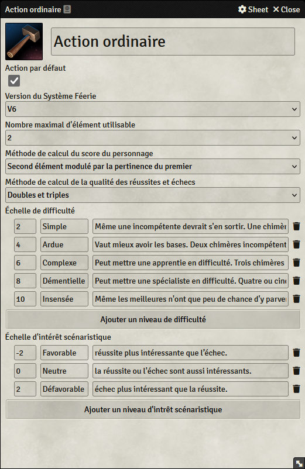

Détails des différentes méthodes de calcul du niveau des personnages :
* *Somme des éléments* : cette méthode fait la somme du niveau de tous les éléments utilisés ;
* *Somme dégressive des éléments* : TODO
* *Meilleur élément + nombre d'éléments* : 
* *Second élément modulé par la pertinence du premier* : 
* *Pertinence du premier élément + nombre d'élément* : 

## Créer des éléments

Les **éléments** définissent mécaniquement les personnages, associant un aspect du personnage à un niveau. Vous pouvez créer un élément de plusieurs manières :
* créer directement l'élément sur la fiche d'un personnage ;
* créer un item séparé ;
* extraire un élément depuis la description d'un personnage.

### Créer un nouvel élément

Vous pouvez directement créer un **élément** sur la fiche d'un personnage en cliquant sur le symbole **+** en haut de l'onglet *Éléments* de la fiche, ou vous pouvez le créer sous la forme d'un Item de type *element* que vous pourrez ensuite glisser-déposer sur les fiches des personnages.

Dans la fenêtre d'édition, vous pourrez définir :
* sa **catégorie** que vous devrez avoir créée en amont ;
* son **niveau**.

Il n'est pas utile de modifier l'icône d'un élément, car celle-ci sera systématiquement remplacée par l'icône de la catégorie.

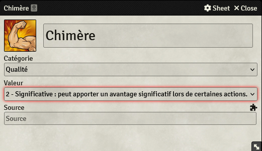

Si vous souhaitez lier un élément d'un personnage à une section de sa description, vous pouvez cliquer sur l'icône en forme de pièce de puzzle pour ouvrir une fenêtre qui vous permettra de sélectionner cette source plus facilement.

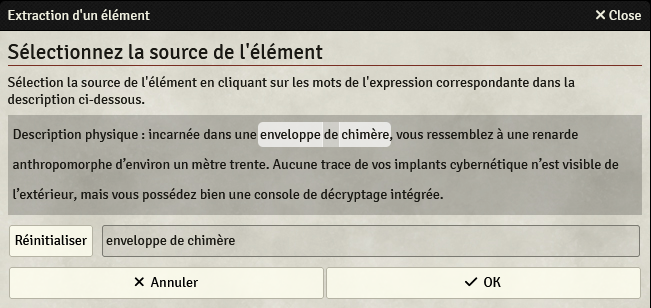

### Extraire un élément

Si la construction du personnage se fait à partir de sa description, vous voudrez créer les éléments directement depuis la description. Pour extraire un élément de la description de votre personnage :
* cliquez sur l'icône en forme de pièce de puzzle au-dessus de la description de votre personnage ;
* dans la nouvelle fenêtre, sélectionnez la portion de texte correspondant à l'élément ;
* puis dans la fenêtre de l'élément, modifiez son nom si nécessaire, sa catégorie et son niveau.

Pour modifier la source d'un élément :
* dans l'onglet *Éléments* de la fiche de personnage, cliquez sur l'icône de modification de l'élément en question ;
* dans la fenêtre de l'élément, vous pouvez modifier le texte de la source ou cliquer sur la pièce de puzzle pour modifier la sélection.

## Créer un personnage

Pour créer un personnage, vous pouvez dupliquer un personnage modèle ou créer un nouvel **actor**. Un personnage modèle n'est rien d'autre qu'un personnage dont certaines sections, notamment les informations descriptives et les ressources, ont été remplies avec des objets vierges ou qui ont la valeur par défaut.

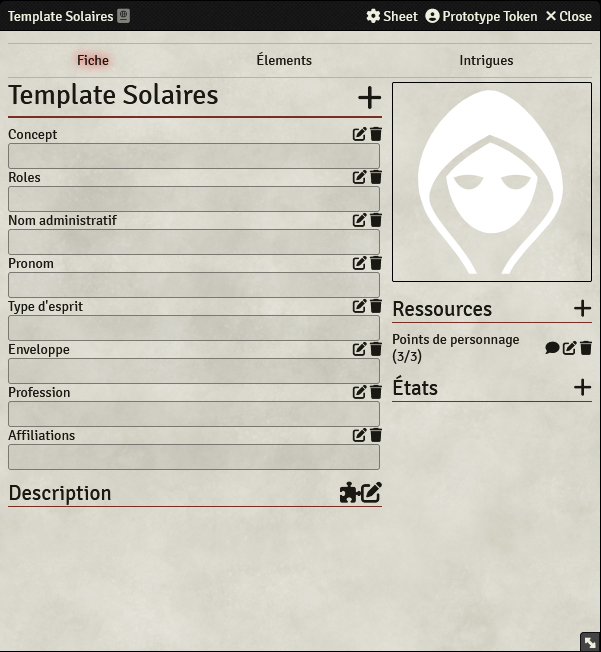

## Faire une action

La mécanique du Système Féerie se concentre sur la résolution des actions et propose un processus un peu différent de la plupart des autres jeux de rôles.

Lorsqu'un personnage va effectuer une action qui a des chances de rater (ou de réussir), le meneur peut demander un jet de résolution.

Pour commencer une action, le meneur peut utiliser la macro *Start Action* qui est à sa disposition dans le compendium *Macros*. Ceci lui ouvrira la fenêtre *Débuter une action*.

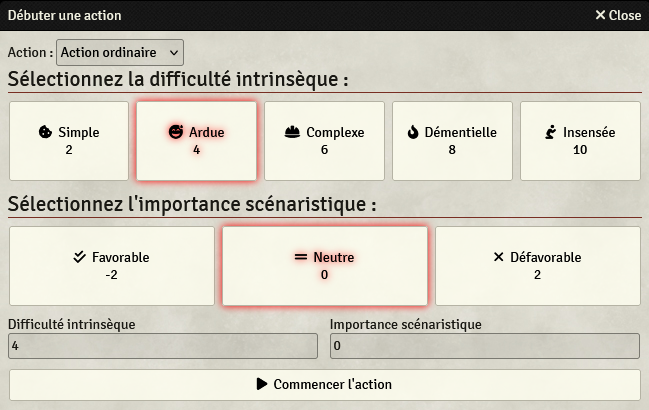

Sur cette fenêtre, le meneur doit choisir le type de l'action si plusieurs actions ont été configurées. Ensuite, il peut définir la difficulté intrinsèque (à quel point l'action est difficile dans l'univers du jeu) et l'intérêt scénaristique (est-ce que la réussite ou l'échec donnerait un résultat plus intéressant que l'autre ?). Une fois son choix validé, il peut cliquer sur *Commencer l'action*. Une boîte d'action va alors apparaître dans le chat.

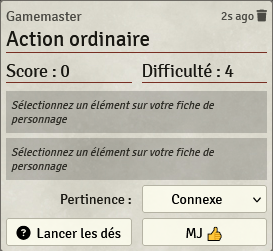

Le joueur peut alors choisir un élément sur sa fiche, en cliquant sur son nom depuis sa description ou dans la liste des Éléments et des États. L'élément sélectionné apparaîtra alors dans la boîte du chat.

Si le meneur l'autorise (en fonction des règles), le joueur eut être amené à ajouter d'autres éléments. De la même façon, d'autres joueurs peuvent apporter un élément de leur personnage, notamment si leur personnage aide l'initiateur.

Le meneur peut indiquer la pertinence du premier élément de la liste. Ceci aura une importance pour la méthode que le système utilisera pour calculer le score du personnage.

Pour retirer un élément de l'action, il est possible de cliquer sur la croix à côté de l'élément en question dans la boîte d'action.

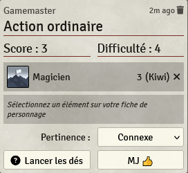

Une fois que le meneur a validé les éléments, il peut cliquer sur le bouton *MJ* et le joueur peut cliquer sur Lancer les dés. Les dés sont alors lancés et le résultat s'affiche !

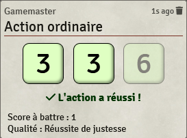

## Faire un jet de chance

Pour faire un jet de chance, le joueur doit utiliser la macro *Jet de chance*. Le résultat du jet de chance sera affiché dans la fenêtre de chat.

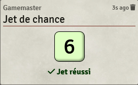

## Remerciements et contributions

Un grand merci à JDW pour le travail qu'il a réalisé sur le système pour Solaires dont certains éléments ont été repris ici (en particulier, la résolution des actions).

Un grand merci à mes cobayes qui ont écopé les bugs (mais ils ont quand même sauvé le monde, alors ça va !).

## Licences

* Le code du module est distribué sous la licence [GPL-3](https://www.gnu.org/licenses/gpl-3.0.en.html)
* Le contenu des compendiums est distribué sous la licence [Creative Commons CC BY-NC-SA 4.0](https://creativecommons.org/licenses/by-nc-sa/4.0/)
