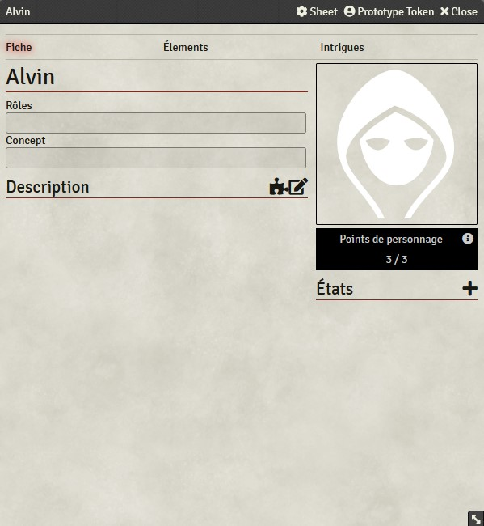
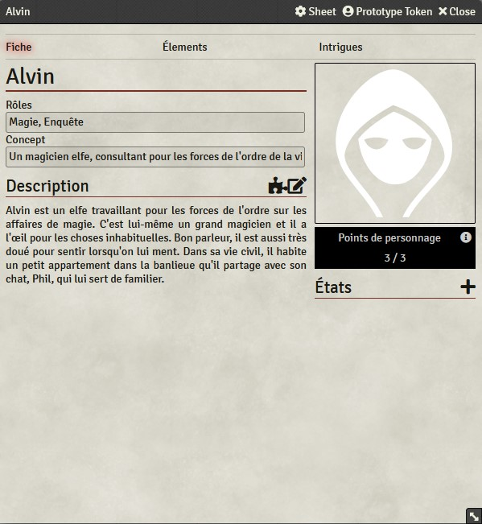
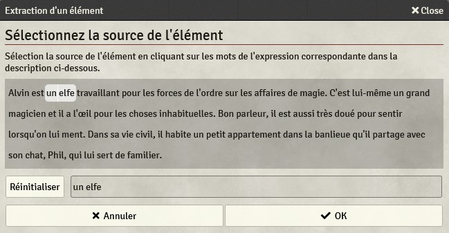
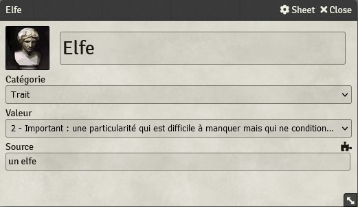
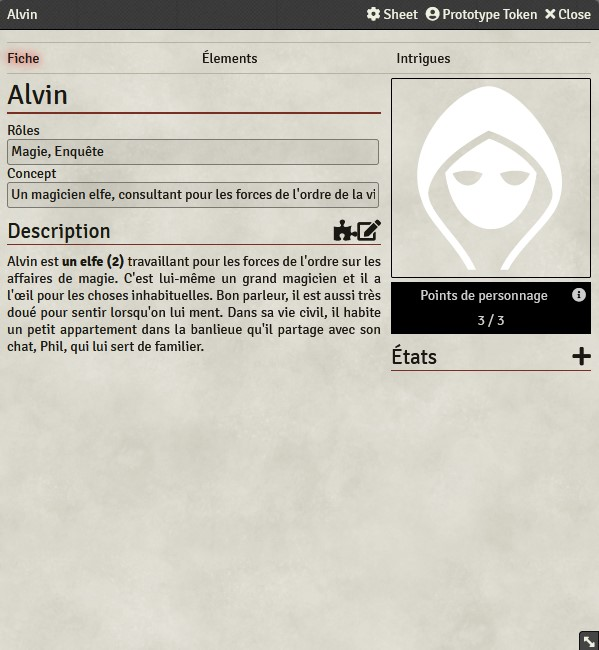
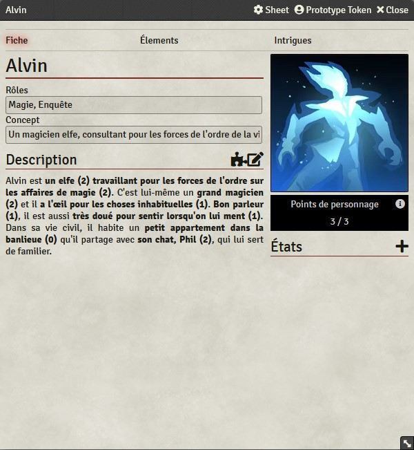
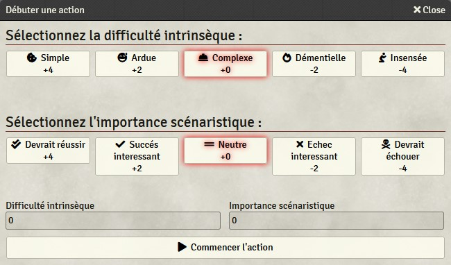
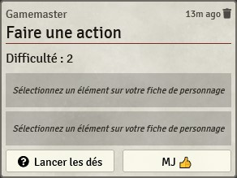
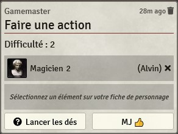
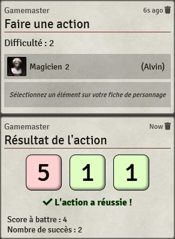

# SystemeFeerie-FoundryVTT

Ce système est conçu pour jour aux jeux utilisant le [*Système Féerie*](https://systeme.feerie.net) avec [*Foundry Virtual Tabletop*](https://foundryvtt.com/).
Le *Système Féerie* est un système de simulation générique descriptif qui favorise la description aux mécaniques habituelles de la plupart des jeux de rôle, que ce soit au niveau de la création des personnages que du système de résolution des actions.

Première particularité, ce système utilise un processus atypique pour la création des personnages : le personnage est initialement défini avec des termes courants, à partir d’un questionnaire ou en rédigeant une description du personnage ; puis les règles transposent simplement et naturellement les éléments de ce personnage en caractéristiques chiffrées qui seront utilisées lors de la résolution des actions. Il n’y a pas de système de points/classe/niveau/archétype pour “encadrer” ou restreindre cette création et dans l’absolu, cette méthode permet de créer n’importe quel personnage de n’importe quel univers.

Dans cette optique descriptive, les règles ne décrivent que des mécaniques de résolution mais sans imposer des règles pour fixer les conséquences (par exemple, il n’y a pas de gestion précise de la santé). Dans l’optique du *Système Féerie*, ce n’est pas au système de jeu de déterminer précisément comment l’action doit se comporter, mais aux participants. Par ailleurs, les règles de résolution ne font aucune distinction sur la nature des actions à résoudre : pas de spécificité pour, par exemple, le combat.

Le *Système Féerie* met une partie du pouvoir narratif entre les mains des joueurs qui leur permettent d’influencer directement la trame scénaristique. Par exemple, ils peuvent décrire eux même, sous certaines conditions, le résultat des actions de leur personnage, ou encore modifier, lier ou introduire des éléments scénaristiques. Et ceci grâce aux points de personnage.

Ce système a été conçu pour être simple et rapide à prendre en main. Comme il a été principalement développé pour Solaires, il se destine principalement aux jeux d’aventures.

## Informations techniques

Lien vers le manifeste du système :
* https://github.com/Greewi/SystemeFeerie-FoundryVTT/releases/latest/download/system.json

Prérequis :
* [*FoundryVTT*](https://foundryvtt.com/) : le logiciel de table virtuelle pour lequel ce système a été conçu.
* [Compendium Folder](https://foundryvtt.com/packages/compendium-folders) : ce module permet d'importer les compendium en conservant l'organisation par dossier.

Modules conseillés :
* [Dice so Nice](https://foundryvtt.com/packages/dice-so-nice/) : des dés en 3D, où comment retrouver la joie de voir les dés rouler en temps réel.
* [Monk's Enhanced Journal](https://foundryvtt.com/packages/monks-enhanced-journal) : un navigateur de journaux et notes très très pratique.
* [PopOut!](https://foundryvtt.com/packages/popout) : permet d'ouvrir les fenêtres des personnages et journaux dans de nouvelles fenêtres.

## Installation

Via l’instalateur de *Foundry* :
1. Dans le menu `Game Systems` de *Foundry*, cliquez sur `Install System`
2. Entrez `https://github.com/Greewi/SystemeFeerie-FoundryVTT/releases/latest/download/system.json` dans Manifest URL
3. Cliquez sur `Install`

Créer et initialiser un monde :
1. Dans le menu `Game Worlds` de *Foundry*, cliquez sur `Create World`
2. Dans `Game System` sélectionnez `Système Féerie`
3. Remplissez les autres informations à votre convenance et cliquez sur `Create World`
4. Connectez-vous en gamemaster et allez dans l’onglet `Game settings`
5. Allez dans `Manage Modules`
6. Activez le module `Compendium Folder` (ainsi que les autres modules que vous souhaitez utiliser)

Installer les compendiums :
1. Allez dans l’onglet `Compendium Packs`
2. Pour chaque compendium : cliquez sur le compendium puis pour chaque répertoire du compendium, cliquez sur l’icône `Importer la structure des dossiers` (Attendez que l’opération soit finie avant de traiter le dossier suivant)
3. Donnez les droits d’observateur aux joueurs des éléments qui vous intéressent (attention, donner les droits sur un dossier, ne donne pas les droits sur les éléments des sous-dossiers !)
4. Pour le compendium `Actions MJ`, nous vous conseillons de glisser la macro `Débuter une action` dans votre barre de raccourcis

Configurer les carégories des éléments :
1. Allez dans l'onglet `Game Setting`
2. Cliquez sur `Configure Settings`
3. Allez dans `System Settings`
4. Cliquez sur `Configurer les catégories`
5. Renommez et modifiez les catégories à votre convenance
6. Pour ajouter une nouvelle catégorie cliquez sur le `plus` tout en haut à droite.
7. Pour désactiver (sans supprimer) une catégorie : cliquez sur la `croix` à droite du titre de la catégorie.
8. Pour supprimer une catégorie cliquez sur l'icone `poubelle`. Notez que vous ne pouvez pas supprimer les catégories initiales (mais vous pouvez les désactiver ce qui revient au même)
9. Une fois satisfait, cliquez sur `Save`.

## Screenshots

## Créer un personnage

Le *Système Féerie* est un système de jeu particulier qui part de la description des personnages pour le construire mécaniquement.

Concrètement, après avoir créé un nouvel acteur, vous vous retrouverez avec la fiche vièrge prête à remplir.

La première étape pour la remplir consiste à choisir les rôles du personnage (une sorte de contrat qui sert à les répartir entre les différents personnages du groupe, histoire). La liste des rôles dépend du jeu joué et des aspects qui seront mis en avant.

La seconde étape consiste à écrire un court concept qui répond à ces rôles pour servir de point de départ à la création du personnage. C'est une phrase courte par exemple : "Un magicien elfe, consultant pour les forces de l'ordre de la ville".

Enfin vient la description, remplissez là en cliquant sur le crayon et définissez plus précisément votre personnage en développant votre concept.

Ceci fait, vous allez extraire les éléments. Il s'agit des mots clés définissant votre personnage auquel vous allez associer un score. Ce sont ces éléments qui seront utilisés lors des jets de dés pour les actions.

Pour extraire un élément, cliquez sur la pièce de puzzle au dessus de la description et vous aurez la fenêtre de sélection de la source d'un élément. Cliquez sur les mots de l'expression que vous souhaitez transformer en élément pour les sélectionner.

Une fois satisfait, cliquez sur « Ok » et la fenêtre de l'élément s'ouvrira. Dedans, vous pouvez modifier le nom de l'élément (Par exemple, « Consultant en magie » est plus clair que « travaillant pour les forces de l'ordre sur les affaires de magie »). Choisissez une catégorie pour l'élément et évaluez sa valeur en fonction de ce que l'élément représente. Si vous souhaitez modifier la source (ce texte correspondant à l'élement dans la description), vous pouvez cliquer sur la pièce de puzzle en bas. Si vous le souhaitez, vous pouvez choisir une autre icone en cliquant dessus.

Une fois l'élément extrait et configuré, vous verrez son expression mise en gras avec son score directement dans la description. Vous le trouverez aussi dans l'onglet *Éléments* de la fiche.

Recommencez pour extraire tous les éléments. Vous pouvez aussi changer le portrait de votre personnage en cliquant dessus. Si le meneur le souhaite, vous pouvez modifier le montant des points de personnage en cliquant dessus (bouton gauche pour diminuer, bouton droit pour l'augmenter).

Voila, le personnage est prêt !

## Faire une action

Lorsqu'un personnage va effectuer une action qui a des chances de rater (ou de réussir), le meneur peut demander un jet de résolution.

Pour commencer une action, le meneur peut utiliser la *Start Action* qui est à sa disposition dans le compendium *Macros*. Ceci lui ouvrira la fenêtre *Débuter une action*.

Sur cette fenêtre, le meneur peut choisir la difficulté intrinsèque (à quel point l'action est difficile dans l'univers du jeu) et l'intérêt scénaristiques (est-ce que la réussite ou l'échèque donnerait un résultat plus intéressant que l'autre ?). Une fois son choix validé, il peut cliquer sur *Commencer l'action*. Une boîte va alors apparaître dans le chat.

Le joueur peut alors choisir un élément sur sa fiche, en cliquant sur son nom depuis sa description ou dans la listes des Éléments et des États. L'élément sélectionné apparaîtra dans la boîte du chat. Si cet élément est typique (par exemple une carrière *Secouriste* serait typique pour une action qui consterait à faire les premiers soins), le meneur peut autoriser un second élément. Pour enlever un élément de l'action, il suffit de cliquer sur la petite croix à droite. (Note : les éléments peuvent provenir de personnages différents)

Une fois que le meneur à validé les éléments, il peit cliquer sur le bouton *MJ* et le joueur peut cliquer sur Lancer les dés. Les dés sont alors lancés et le résultat s'affiche !

## Remerciements et contributions

Un grand merci à JDW pour le travail qu'il a réalisé sur le système pour Solaires dont certains éléments ont été repris ici (en particulier, la résolution des actions).

Un grand merci à mes cobayes qui ont écopé les bugs (mais ils ont quand même sauvé le monde, alors ça va !).

## Licences

* Le code du module est distribué sous la licence [GPL-3](https://www.gnu.org/licenses/gpl-3.0.en.html)
* Le contenu des compendiums est distribué sous la licence [Creative Commons CC BY-NC-SA 4.0](https://creativecommons.org/licenses/by-nc-sa/4.0/)
